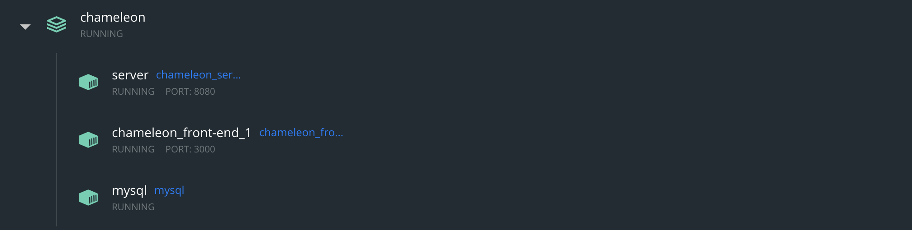

# Chameleon

Chameleon is a web-based malware analytic tool that uses machine learning under the hood. The most prominent feature of th etool is its ability to identify new malware sample without the need to retrain the model. This makes it incredibly efficient tool analyzing polymorphic and meta-morphic malware samples as well.

# Project Structure

Project is divided into three major areas:

  1. **front-end (dir: front-end)**: Contains react code for creating an interactive User Interface.
     - **Technologies Used**: npm, node, JavaScript, React
     

  2. Back-end Server (dir: src) : Java Spring based that handles the requests coming in from front-end as well as initiating the machine learning model for file analysis.
    
     - **Technologies Used**: Spring Lombok, Spring RestFULL, Spring Lombok, Spring JDBC, MYSQL, SQL, gradle, and Java


  3. Machine Learning Models(dir: Virus Detection): HMM and KNN based models that analyze the incoming files
    - **Technologies Used**: Pandas, Sklearn, Numpy, Cython, HMM, and python

# System Requirements

System Requirements of this project are quite complex, as we have various three different technology stack that needs to be configured properly in order for the prototype to work properly. But we have abstracted all these complications using docker, so that anyone can easily run the demo.
 1. Docker : Here is the link to install docker on your system [Click Here](https://docs.docker.com/get-docker)

# Steps to run the Prototype
 1. Clone the repo into you local machine:
```
$ git clone https://github.com/Chahat001/Chameleon.git
```

 2. Navigate Inside the Repository:
```aidl
$ cd Chameleon
```

 3. Use the docker-compose file to build the system:

```aidl
$ docker-compose up --build
```

4. Wait until all the three containers required are up and running. Use can use the following command to check the status of the containers:

```aidl
$ docker ps -a
```

Once All three containers are up as displayed below:


5. Open Your browser all enter ``` localhost:3000```. This should display the main webpage where you can interact with our prototype.